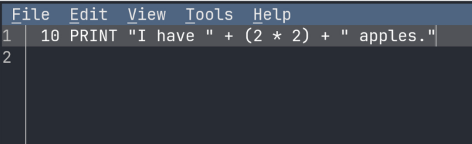
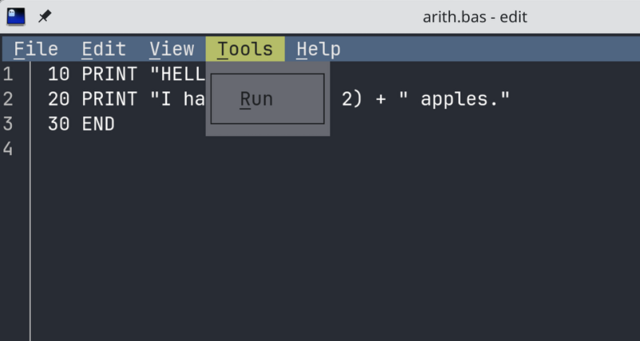
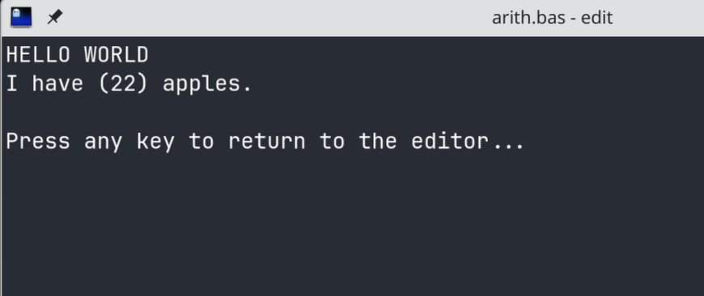

# JPEdit

A fork of a simple editor for simple needs (plus a BASIC interpreter if you need that!)

This fork of [Microsoft Edit](https://github.com/microsoft/edit) also includes a BASIC interpreter to run the current open file as a BASIC program. This feature will never be put into the upstream project, and should be used just for fun. More comprehensive BASIC interpreters exist, and due to constraints of terminal emulators, it will never have support for things like graphics.

## Build Instructions

* [Install Rust](https://www.rust-lang.org/tools/install)
* Install the nightly toolchain: `rustup install nightly`
  * Alternatively, set the environment variable `RUSTC_BOOTSTRAP=1`
* Clone the repository
* For a release build, run:
  * Rust 1.90 or earlier: `cargo build --config .cargo/release.toml --release`
  * otherwise: `cargo build --config .cargo/release-nightly.toml --release`

### Build Configuration

During compilation you can set various environment variables to configure the build. The following table lists the available configuration options:

Environment variable | Description
--- | ---
`EDIT_CFG_ICU*` | See [ICU library name (SONAME)](#icu-library-name-soname) for details.
`EDIT_CFG_LANGUAGES` | A comma-separated list of languages to include in the build. See [i18n/edit.toml](i18n/edit.toml) for available languages.

### BASIC Commands

The supported BASIC commands are very small so far, and a little buggy. Use at your own risk.

1. PRINT 
2. GOTO
3. END
